# AI Sales Engineer — Complete System Flowchart (v4.2)

---

## 1. Top-Level Architecture: Request Lifecycle

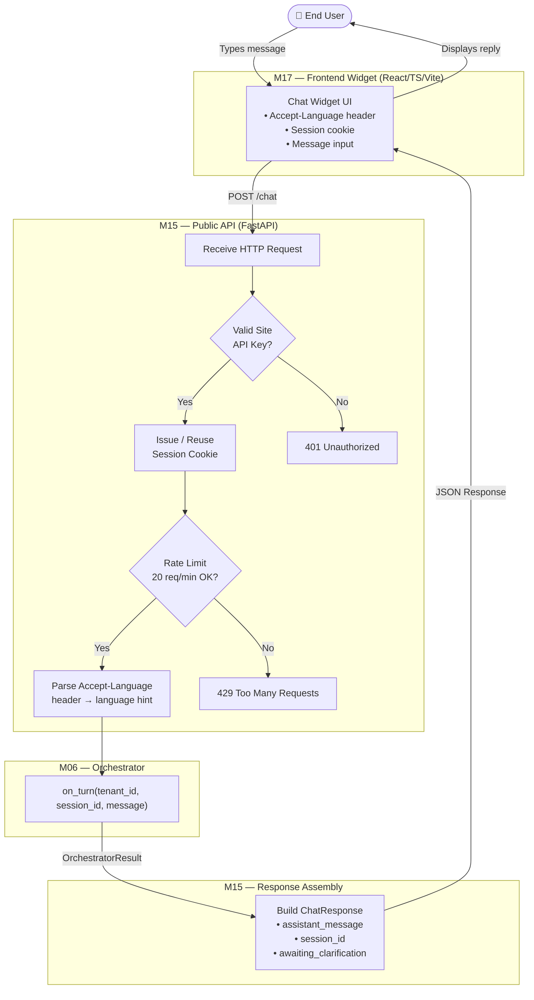

---

## 2. Orchestrator Turn Flow (M06)

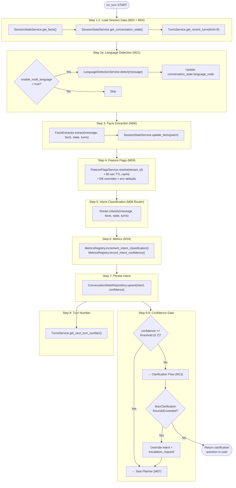

---

## 3. Intent Classification: Tier 1 + Tier 2 (M06 Router)

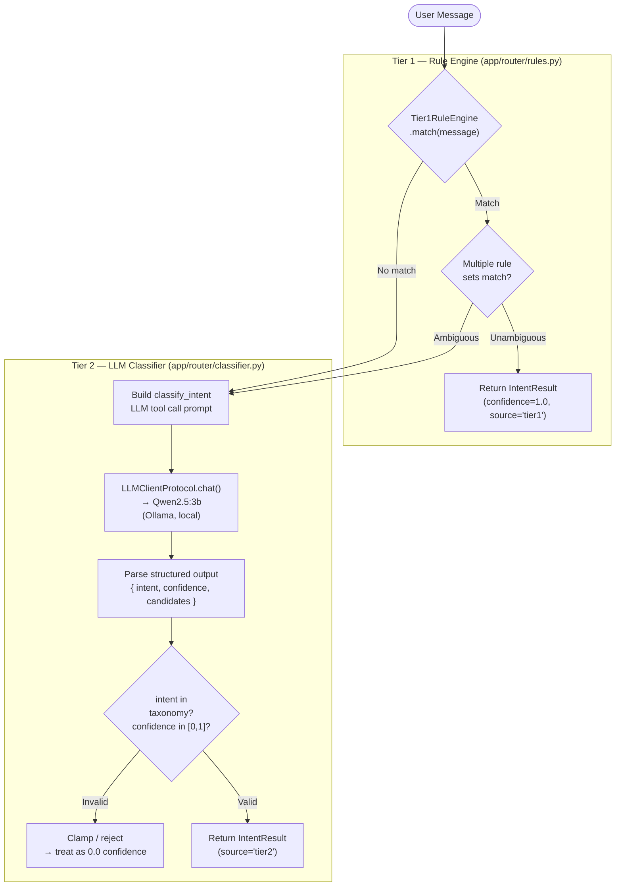

**Full Intent Taxonomy (v4.1 + v4.2):**

| Group | Intents |
|---|---|
| **Sales** | `sales_inquiry`, `quote_request` |
| **Support** | `technical_support`, `troubleshooting`, `installation_guidance`, `warranty_information` |
| **Product Intelligence** | `product_comparison`, `product_compatibility`, `accessory_recommendation`, `product_finder_by_problem`, `product_alternative`, `specification_explainer` |
| **Discovery** | `product_recommendation_wizard`, `use_case_recommendation`, `pdf_documentation_search` |
| **Transactional** | `availability_inquiry`, `solution_builder`, `human_handoff`, `escalation_request` |
| **System** | `out_of_scope` |

---

## 4. Task Planner → Tool Executor (M07 + M10)

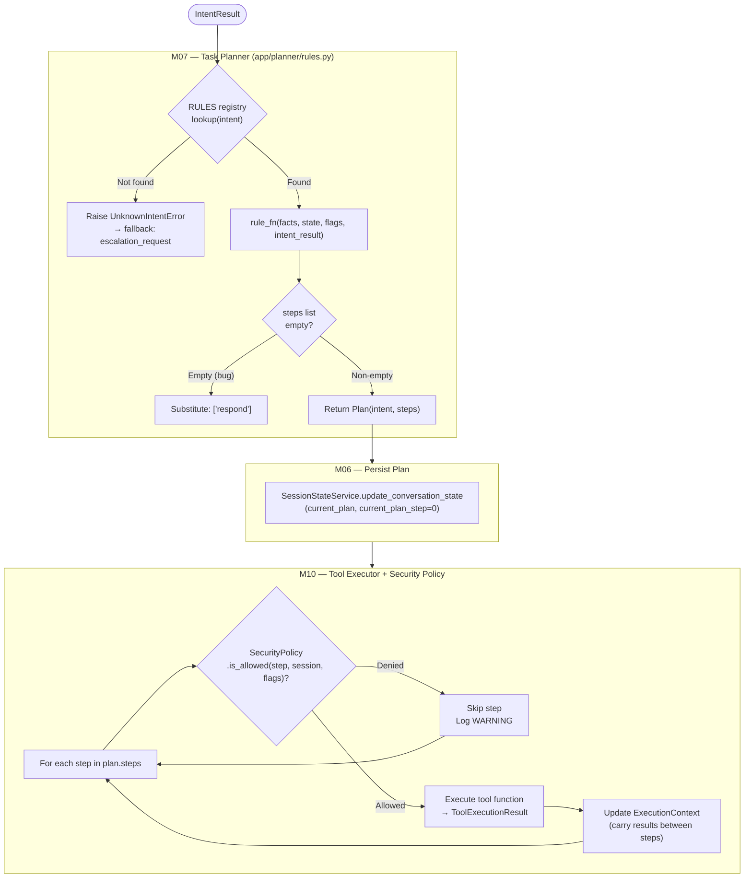

---

## 5. Tool Execution Map — All 17 Tool Steps

```mermaid
flowchart LR
    EXEC(["Tool Executor\nexecute_plan()"])

    subgraph RAG["M11 — RAG Engine"]
        T_RP["retrieve_products\n• FilterExtractor → SQL narrow\n• Qdrant vector search\n• BGE-M3 embeddings"]
        T_RD["retrieve_docs\n• doc_type filter\n• Qdrant documents_v1\n• intent→doc_type mapping"]
    end

    subgraph INTEL["M18 — Product Intelligence"]
        T_CP["compare_products\n• ProductSpecRepository\n• Comparison table\n• LLM summary (narration only)"]
        T_CC["check_compatibility\n• CompatibilityRepository\n• Rule → LLM fallback inference"]
        T_RA["recommend_accessories\n• AccessoryRepository\n• Vector similarity supplement"]
        T_FA["find_alternatives\n• Same-category SQL\n• Qdrant re-rank"]
        T_ES["explain_specification\n• LLM explanation\n• Doc context grounding"]
    end

    subgraph SOL["M19 — Solution Builder"]
        T_WIZ["run_wizard\n• WizardService.advance()\n• 4-step requirement collection (no budget)\n• ScaleClassifier auto-detects scale\n• Calculated or Call-For-Pricing\n• Persists to wizard_sessions"]
        T_UC["build_use_case_solution\n• UseCaseService\n• Pre-defined profiles (7)\n• BOMService.build()"]
        T_BS["build_solution\n• BOMService.build()\n• Deterministic pricing\n• SolutionExplainer (LLM narration)"]
    end

    subgraph QUOTE["M12 — Quote Builder"]
        T_GQ["generate_quote\n• QuoteBuilder (SQL pricing)\n• QuoteExplainer (LLM narration)\n• QuotePDFGenerator (reportlab)\n• Email PDF via Resend"]
        T_MS["request_missing_slots\n• Ask for missing\n  company/product/qty/budget"]
    end

    subgraph CRM["M14 — CRM + Email"]
        T_CL["create_lead\n• LeadService.create_lead()\n• Extended qualification fields\n• Retry queue → CRM sync\n• Email notification (Resend)"]
    end

    subgraph HANDOFF["M20 — Human Handoff"]
        T_IH["initiate_handoff\n• Export conversation (50 turns)\n• Create handoff_requests record\n• Email team (fire-and-forget)\n• Return reference ID"]
    end

    subgraph AVAIL["M22 — Availability"]
        T_CA["check_availability\n• LocalAvailabilityService\n  (or ERPAvailabilityService stub)\n• product_availability table"]
    end

    subgraph RESPOND["M05 — LLM Engine"]
        T_RS["respond\n• Assemble final message\n• LLM builds natural language reply\n• Uses tool results from ExecutionContext"]
    end

    EXEC --> T_RP & T_RD & T_CP & T_CC & T_RA & T_FA & T_ES
    EXEC --> T_WIZ & T_UC & T_BS
    EXEC --> T_GQ & T_MS
    EXEC --> T_CL
    EXEC --> T_IH
    EXEC --> T_CA
    EXEC --> T_RS
```

---

## 6. RAG Engine Pipeline (M11)

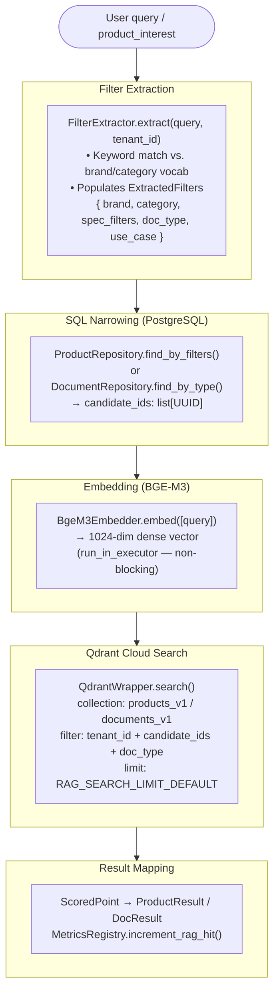

---

## 7. Multi-turn Wizard Flow (M19)

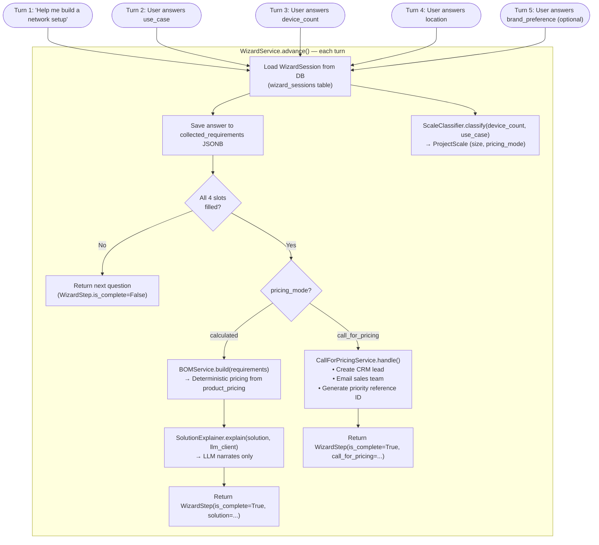

---

## 8. Human Handoff Flow (M20)

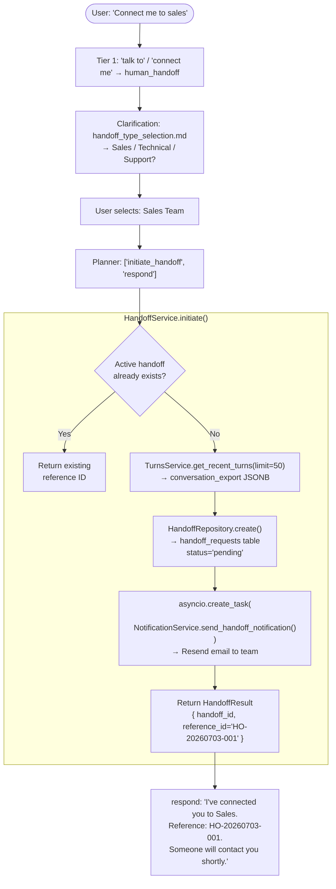

---

## 9. Multi-language Pipeline (M21)

```mermaid
flowchart LR
    MSG_IN(["User message\n(any language)"])

    subgraph DET["Language Detection"]
        LD["LanguageDetectionService.detect(message)\n(langdetect library)\n→ 'en' | 'ur' | 'ar'"]
        LD_SAVE["Update conversation_state.language_code"]
    end

    subgraph PROCESS["Full Turn Processing\n(all in English)"]
        P1["Facts extraction"]
        P2["Intent classification"]
        P3["RAG retrieval"]
        P4["Tool execution"]
        P5["Response assembly (English)"]
    end

    subgraph TRANSLATE["Response Translation"]
        TR_CHECK{"language_code\n!= 'en'?"}
        TR_RUN["TranslationService.translate(\n  text=english_response,\n  target='ur' or 'ar',\n  llm_client=qwen2.5:3b\n)"]
        TR_FAIL{"LLM\nfailed?"}
        TR_ORIG["Return original\nEnglish response"]
        TR_OUT["Translated response"]
    end

    RESP_OUT(["Response in user's language"])

    MSG_IN --> DET --> LD_SAVE
    LD_SAVE --> PROCESS
    PROCESS --> TR_CHECK
    TR_CHECK -->|"Yes"| TR_RUN --> TR_FAIL
    TR_CHECK -->|"No (already English)"| RESP_OUT
    TR_FAIL -->|"Yes"| TR_ORIG --> RESP_OUT
    TR_FAIL -->|"No"| TR_OUT --> RESP_OUT
```

---

## 10. Storage Systems Map

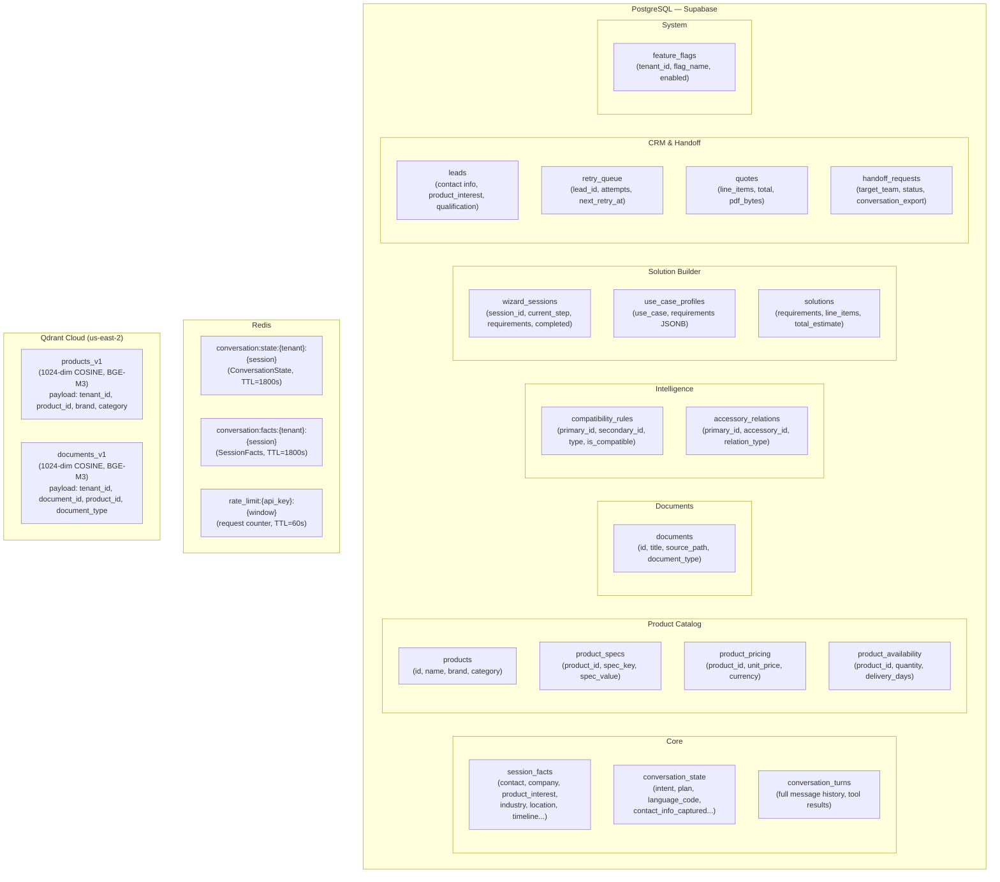

---

## 11. External Services & Infrastructure

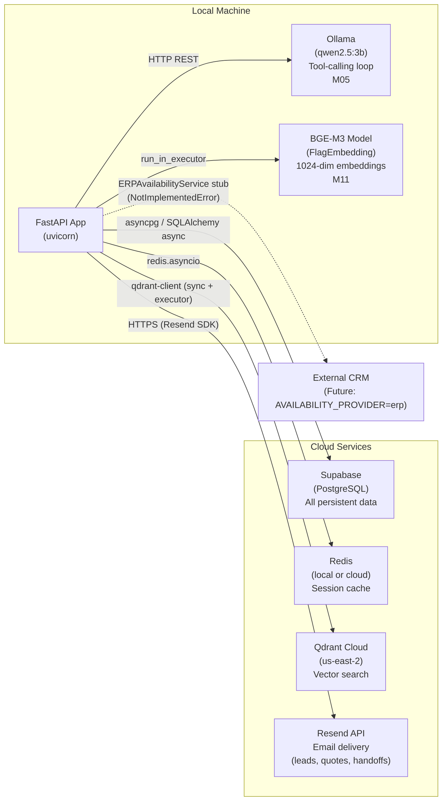

---

## 12. Complete Turn Sequence (Happy Path — Quote Request)

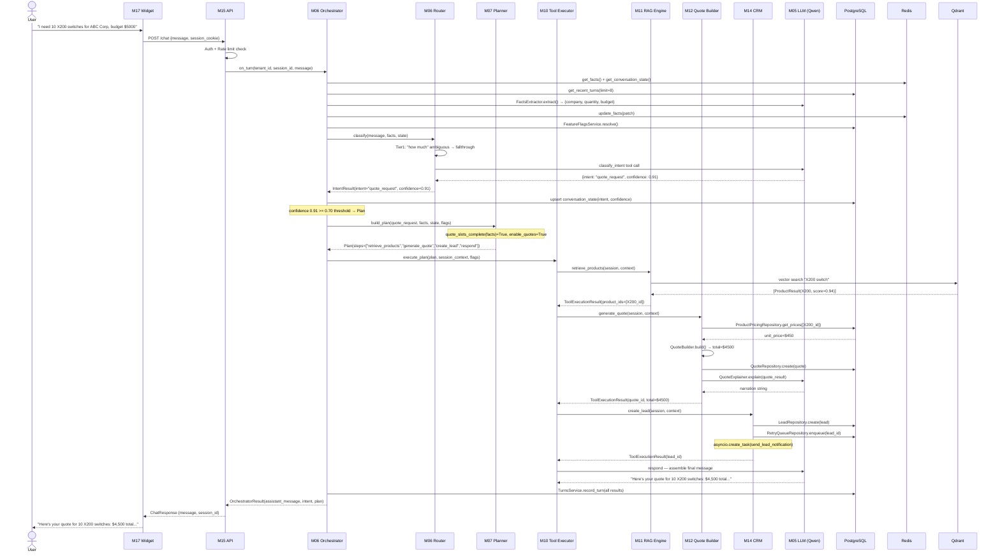

---

## 13. CRM Retry Worker Flow (M14 — Background)

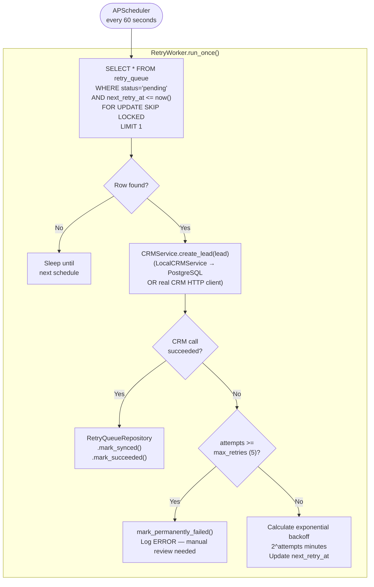

---

## 14. Observability Flow (M16)

```mermaid
flowchart LR
    subgraph MODULES["All Modules emit metrics"]
        M6_M["M06: intent_classification_total\nintent_confidence_histogram"]
        M11_M["M11: rag_hit_total"]
        M12_M["M12: quote_generated_total\nquote_pdf_generated_total"]
        M14_M["M14: lead_created_total\ncrm_sync_total"]
        M18_M["M18: comparison_requests_total\ncompatibility_checks_total"]
        M19_M["M19: solution_builds_total\nwizard_sessions_total"]
        M20_M["M20: handoff_requests_total"]
        M21_M["M21: language_detection_total\ntranslation_requests_total"]
        M22_M["M22: availability_checks_total"]
    end

    subgraph REGISTRY["M16 — MetricsRegistry\n(prometheus_client, in-process)"]
        REG["Prometheus Counters\n+ Histograms"]
    end

    subgraph ENDPOINTS["M15 — Endpoints"]
        EP_METRICS["GET /metrics\n→ prometheus text format"]
        EP_READY["GET /ready\n→ { db, redis, ollama } status"]
    end

    MODULES --> REGISTRY
    REGISTRY --> EP_METRICS
    EP_READY --> DB_CHECK["Async DB ping"]
    EP_READY --> REDIS_CHECK["Redis ping"]
    EP_READY --> OLLAMA_CHECK["Ollama /api/tags check"]
```

---

## 15. Module Dependency Map

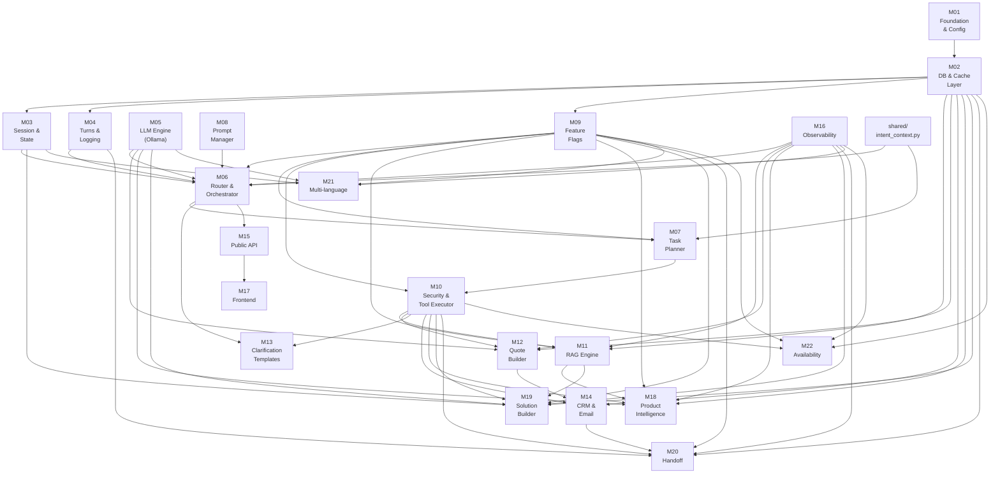
